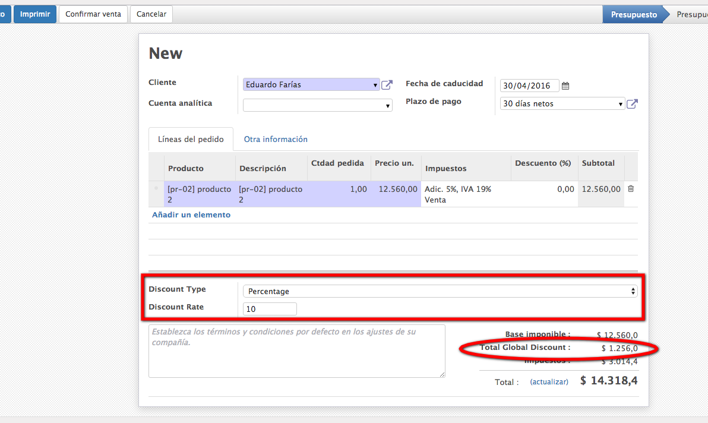
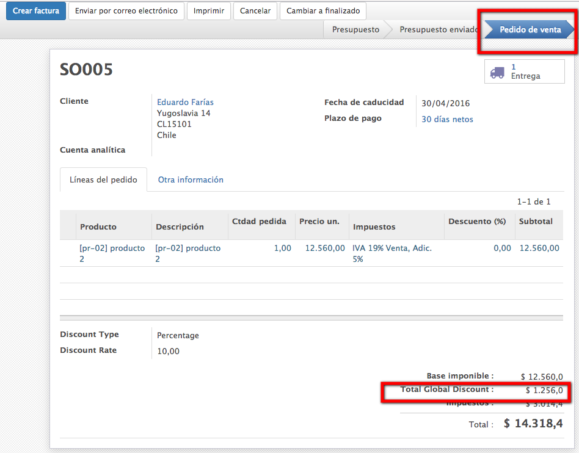
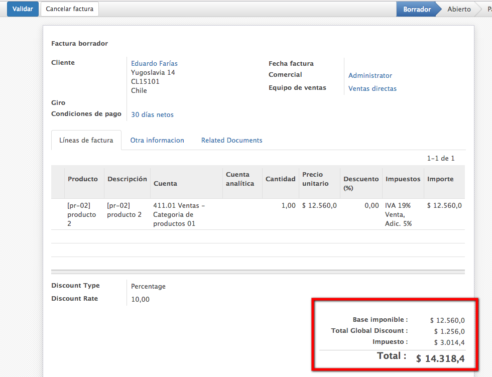
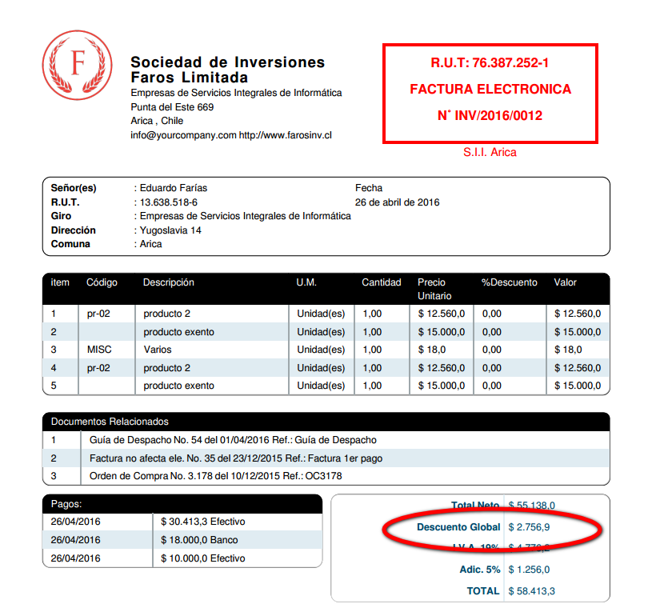

# Odoo - Sale Global Discount

## Summary
This module add fields to Odoo to set global discount in Sale orders and Invoices.

## Description
This module adds functioanlity to set a global discount to sale orders and invoices by percentage or amount. This is part of the [Odoo Chile DTE's project](https://github.com/farosinv/odoo_cl_dte). The Global discount is calculated before taxes to the amount_untaxed field, finally printed in the electronic invoice according to chilean dte's.

Currently under development

## Features
- [x] Set global discount to quotes

- [x] Global discount pass to sale order

- [x] Global disount to invoice

- [x] Global discount printed in electronic invoice (by [l10n_cl_dte](https://github.com/farosinv/odoo_cl_dte) module

Desarrollado por

http://www.farosinv.cl
